# Hash_table
## Содержание  
* [Аннотация](#annotation)  
* [Первая часть](#firstpart)  
	* [Теория](#theory)  
	* [Сравнение хэш-функций](#comp)   
		* [const hash function](#hf1) 
		* [first symbol hash function](#hf2) 
		* [length hash function](#hf3) 
		* [sum hash function](#hf4) 
		* [right cycle rotate hash function](#hf5) 
		* [left cycle rotate hash function](#hf6) 
		* [super secret hash function](#hf7) 
	* [Вывод](#conc1)
* [Вторая часть](#secondpart)  
	* [Техническая справка](#tech)  
	* [Оптимизация хэш-таблиц](#opt)  
		* [Применение AVX-инструкций](#avxinstr) 
		* [Ассемблерные функции](#asm) 
		* [Использование интрисиков](#crc32) 
	* [Вывод](#conc2)
* [Заключение](#conc)

## Аннотация <a name="annotation"></a>

Данный проект нацелен на изучение принципов работы хэш-таблиц, сравнение различных хэш-функций и изучение их поведения на конкретных наборах данных, развитие практических навыков при работе с профайлингом, в применении оптимизаций на различных уровнях. 

Из-за наличия большого числа исследуемых тем, данная работа представлена в двух отдельных частях, в каждой из которых в полной мере исследованы интересующие вопросы. Важной составляющей в представленном проекте являлось написание **README**, объёмно отражающей ход проделанной работы. 


---

## Первая часть <a name="firstpart"></a>
Первая часть проекта посвящена изучению работ различных хэш-функций. Необходимо было исследовать эффективность работы хэш-функций на тексте - проанализировать распространенность коллизий в каждом отдельном списке хэш-таблицы. Все хэш-функции проверялись на трагедии Уильяма Шекспира "Трагическая история о Гамлете, принце датском", представленном на анлийском языке.

### Теория <a name="theory"></a>
В моем проекте используется **открытое хэширование**, которое представляет из себя работу со списками. Открытое хеширование или **Метод цепочек** – это технология разрешения коллизий, которая состоит в том, что элементы множества с равными хеш-значениями связываются в цепочку-список. Коллизии просто приводят к тому, что появляются списки длиной более одного элемента (можно почитать про это [здесь](https://intuit.ru/studies/courses/648/504/lecture/11467?page=3) и [здесь](https://ru.wikipedia.org/wiki/%D0%A5%D0%B5%D1%88-%D1%82%D0%B0%D0%B1%D0%BB%D0%B8%D1%86%D0%B0)).

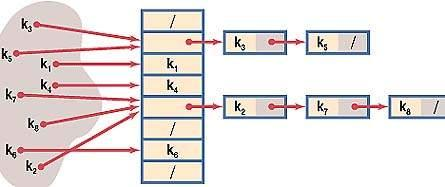

---

### Сравнение хэш-функций <a name="comp"></a>
Для проведения сранения были выбраны 7 различных хэш-функий, отличающихся своими подходами к хэшированию данных.

Оценивать эффективность работы функций будем при помощи вычисления **среднеквадратического отклонения**. Это наиболее распространённый показатель рассеивания значений случайной величины относительно её математического ожидания (можно почитать про это [здесь](https://ru.wikipedia.org/wiki/%D0%A1%D1%80%D0%B5%D0%B4%D0%BD%D0%B5%D0%BA%D0%B2%D0%B0%D0%B4%D1%80%D0%B0%D1%82%D0%B8%D1%87%D0%B5%D1%81%D0%BA%D0%BE%D0%B5_%D0%BE%D1%82%D0%BA%D0%BB%D0%BE%D0%BD%D0%B5%D0%BD%D0%B8%D0%B5#%D0%9E%D1%86%D0%B5%D0%BD%D0%BA%D0%B0_%D1%80%D0%B8%D1%81%D0%BA%D0%BE%D0%B2_%D0%B8_%D0%BA%D1%80%D0%B8%D1%82%D0%B8%D0%BA%D0%B0)). 

В частности, если xi - **i-й элемент выборки**, n - **объём выборки**, x` - **среднее арифметическое выборки** (выборочное среднее - оценка математического ожидания величины), то:

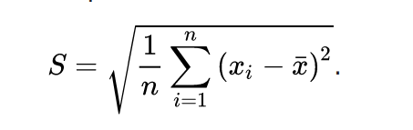

---

#### const hash function <a name="hf1"></a>
Данная функция всегда возвращает **1** при любых вводных данных. 

Очевидно, что число коллизий в данном случае максимально, так как используется только один список из всей хэш-таблицы. Данный пример отражает нижнюю оценку работы всех возможных хэш-функций.

```c++
unsigned int constHf (char *line)
{
    return 1;
}
```

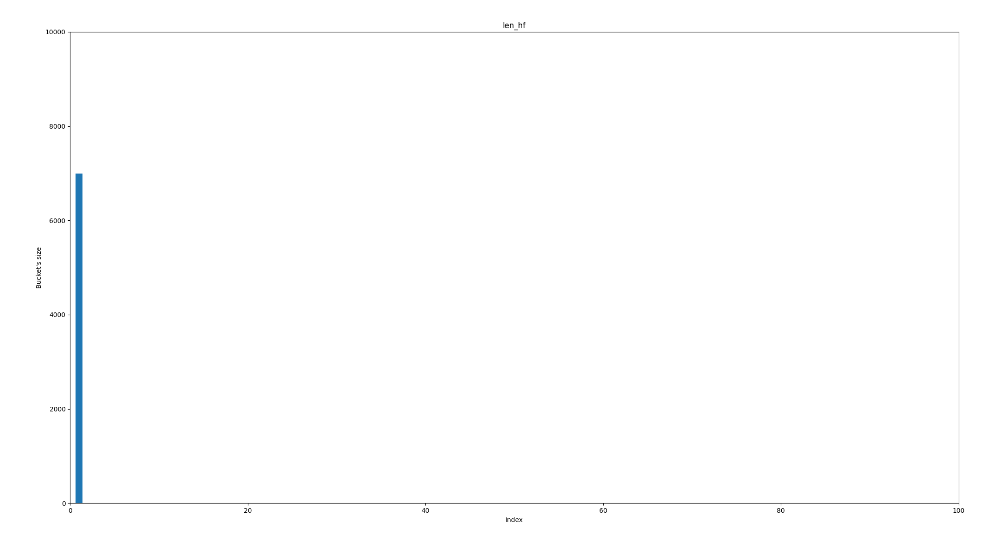

> Среднеквадратическое отклонение: 247

#### first symbol hash function <a name="hf2"></a>
Данная функция возвращает **ASCII-код первого символа** всей строки. 

Число коллизий уменьшено по сравнению с предыдущей функцией. По ниже приведенному графику несложно догадаться, что максимумы обусловлены лишь фонетическими особенностями исходных данных. Все зависит от распространенности слов, начинающихся с определенных букв, что при особенностях работы с текстом, приводит к большому числу коллизий в отдельных списках.

```c++
unsigned int firstSymHf (char *line)
{
    return (line[0] % hash_size);
}
```

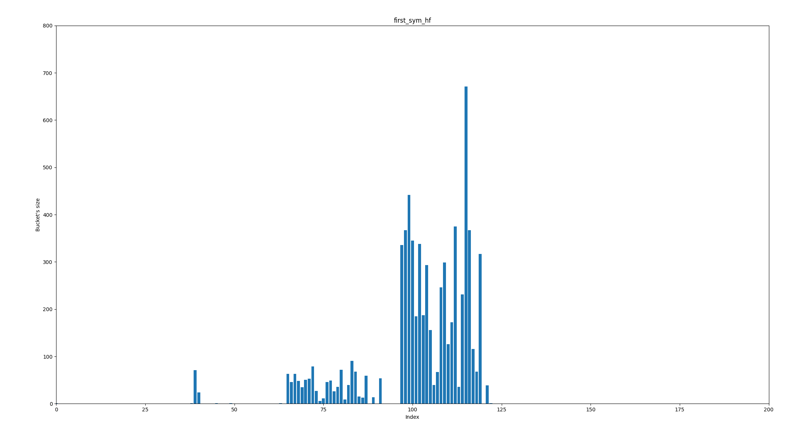

> Среднеквадратическое отклонение: 50

#### length hash function <a name="hf3"></a>
Данная хэш-функция возвращает **длину получаемой строки**. 

Заметим, что все записи лежат в самых первых списках, а остальные - пусты. Это обусловлено тем, что длина слов во входном тексте (в языке) варьируется в этой области. Неэффективно, но все же лучше первой функции.  

```c++
unsigned int lenHf (char *line)
{
    return (strlen (line) % hash_size);
}
```

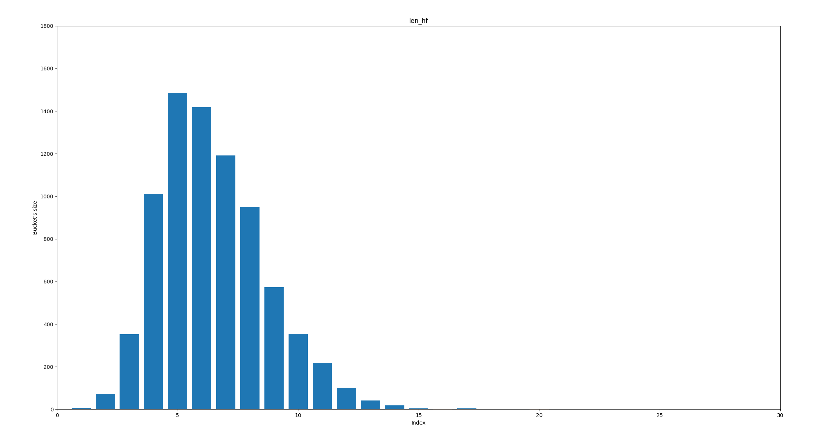

> Среднеквадратическое отклонение: 90

#### sum hash function <a name="hf4"></a>
Данная хэш-функция возвращает **сумму всех ASCII-кодов** символов, взятой по модулю размера хэш таблицы. 

Опять же, работа данной хэш функции будет сильно зависеть от длин слов в исходном тексте, и при больших размерах хэш-таблиц это привёдет к малой заселенности последних списков. Но пока это самая лучшая хэш-функция из представленных ранее. 

```c++
unsigned int sumHf (char *line)
{
    unsigned int hash_sum = 0;
    unsigned int line_len = strlen (line);

    for(unsigned int i = 0; i < line_len; i++)
    {
        hash_sum = (hash_sum + line[i]);
    }

    return (hash_sum % hash_size);
}
```

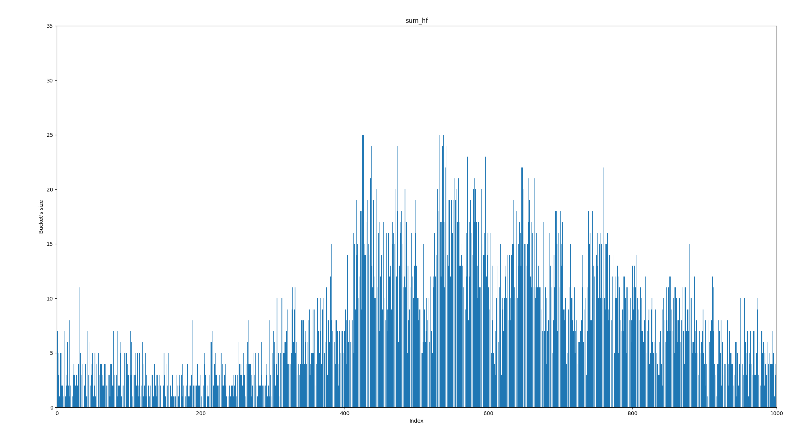

> Среднеквадратическое отклонение: 5.38

#### right cycle rotate hash function <a name="hf5"></a>
Эти и последующие хэш-функции являются наиболее эффективными, так как они позволяют избежать совпадения возвращаемых значений для почти одинаковых слов. 

Данная функция использует **правый циклический сдвиг** для вычисления хэш-ключа.

```c++
unsigned int roundRightHf (char *line)
{
    unsigned int hash_sum = 0;
    unsigned int line_len = strlen (line);

    for(unsigned int i = 0; i < line_len; i++)
    {
        hash_sum = (hash_sum >> 1) | (hash_sum << (32 - 1));
        hash_sum ^= line[i];
    }

    return (hash_sum % hash_size);
}
```

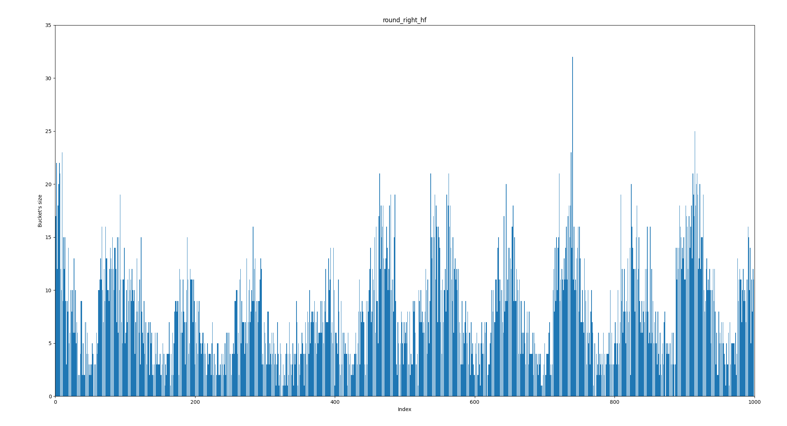

> Среднеквадратическое отклонение: 4.79

#### left cycle rotate hash function <a name="hf6"></a>
Данная функция не отличается идейно от предыдущей, но на проверяемых мною данных показала лучший результат. 

Данная функция использует **левый циклический сдвиг** для вычисления хэш-ключа. 

```c++
unsigned int roundLeftHf (char *line)
{
    unsigned int hash_sum = 0;
    unsigned int line_len = strlen (line);

    for(unsigned int i = 0; i < line_len; i++)
    {
        hash_sum = (hash_sum << 1) | (hash_sum >> (32 - 1));
        hash_sum ^= line[i];
    }

    return (hash_sum % hash_size);
}
```

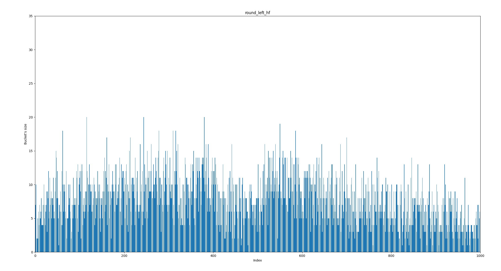

> Среднеквадратическое отклонение: 3.6

#### super secret hash function <a name="hf7"></a>
Проект включает и изучение работы собственно предложенной хэш-функции. 

Мною была выбрана **полиномиальная хэш-функция**, которая основана на методе вычисления хэш-суммы, но при этом используется **значение многочлена** с заданными коэффициентами (символы в строке). 

Этот пример является лучшим из всех предыдущих, но и **left cycle rotate hash function** показала схожий по эффективности результат. 

```c++
unsigned int superSecretHf (char *line)
{
    unsigned int hash_sum = 0;
    unsigned int hash_par = 1;
    unsigned int hash_base = hash_size + 1;
    unsigned int line_len = strlen (line);

    for(unsigned int i = 0; i < line_len; i++)
    {
        hash_sum += (unsigned int) (line[i]) * hash_par;
        hash_par *= hash_base;
    }

    return (hash_sum % hash_size);
}
```

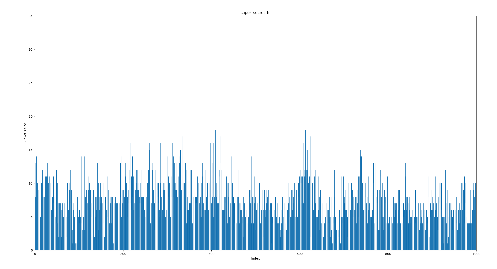

> Среднеквадратическое отклонение: 3.16

---

### Вывод <a name="conc1"></a>
Хэш-таблицы представляют из себя структуру данных, которая позволяет сократить время работы с данными, удобно хранить их для последующих операций. 

По проведенным ранее сравнениям оказалось, что верный выбор подходящей для текущей задачи функции позволяет сделать работу с хэш-таблицей наиболее эффективной. Разработчику нужно анализировать входные данные, чтобы можно было исключить сложные и ненужные вычисления из-за громоздкой хэш-функции.

---
---

## Вторая часть <a name="secondpart"></a>
Вторая часть моей работы посвящена работе с профайлером и поиском-применением оптимизаций для ускорения поиска записей в хэш-таблице. 

---

### Техническая справка <a name="tech"></a>

Я использовал **Callgrind** - инструмент для анализа производительности программного обеспечения. Он эмулирует каждую исполняемую инструкцию программы и на основании внутренних метрик о «стоимости» работы каждой инструкции выдает нужное нам заключение.

При помощи инструмента **KCachegrind** будем строить графики, визуализирующие данные, полученные при помощи инструмента профилирования программы.  

Чтобы исключить влияние остальных частей программы, поиск конкретных элементов производился многократно. В этом случае это позволяло максимально полно отразить картину работы поиска в хэш-таблице.


### Оптимизация хэш-таблиц <a name="opt"></a>


---

#### Применение AVX-инструкций <a name="avxinstr"></a>
При проведении первого исследования работы программы, оказалось, что большего всего времени тратилось на сравнение текущей и требуемой строк:

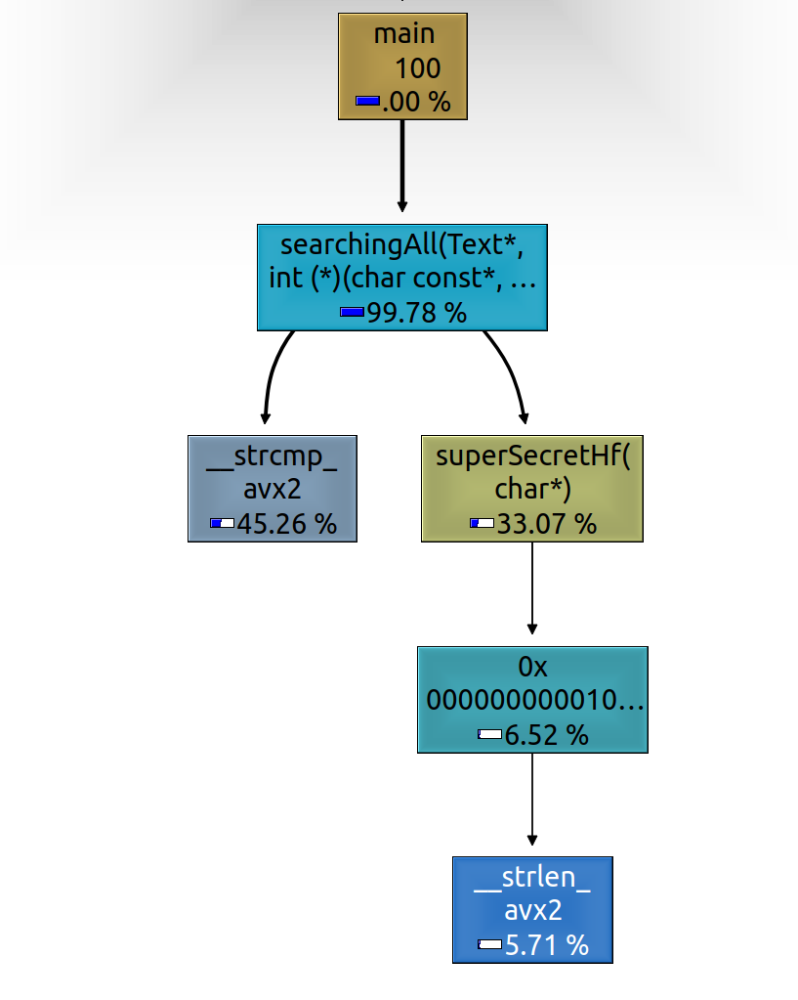

Чтобы ускорить этот процесс было решено перевести исходные данные в 256-битный формат. Это позволило использовать соответсвующие SIMD-инструкции и регистры для сравнения строк: 

```c++
int strcmpAvx (const char *s1, const char *s2)
{
    __m256i *s1_vector = ( __m256i* ) s1;
    __m256i *s2_vector = ( __m256i* ) s2;

    __m256i cmp = _mm256_cmpeq_epi8 (*s1_vector, *s2_vector);
    int cmp_mask = _mm256_movemask_epi8 (cmp);

    if(cmp_mask == equal_mask) 
    {
        return 0;
    }

    return 1;
}
```

| режимы        | число м. команд    | ускорение          |
| ------------- | ------------------ | ------------------ |
| NO AVX        | 5765331050         | 1.0                |
| AVX           | 4215002668         | 1.36               |

После проведения соответсвующих оптимизаций скорость работы программы увеличилась на 30 процентов. 

Оказалось, что для удобной и красивой обработки входных данных достаточно преобразовать исходные данные так, что в дальнейшем с ними было удобно оперировать. Хотя и время, которое тратится на преобразование входных данных увеличилось, время работы программы уменьшилось. Так работает закон Амдала. Таким образом, нам опять пригодилось использование AVX-инструкций, которые хорошо подходят для обработки большого числа данных.

---

#### Ассемблерные функции <a name="asm"></a>
На следующем этапе оказалось, что больше всего стала весить хэш-функция. 

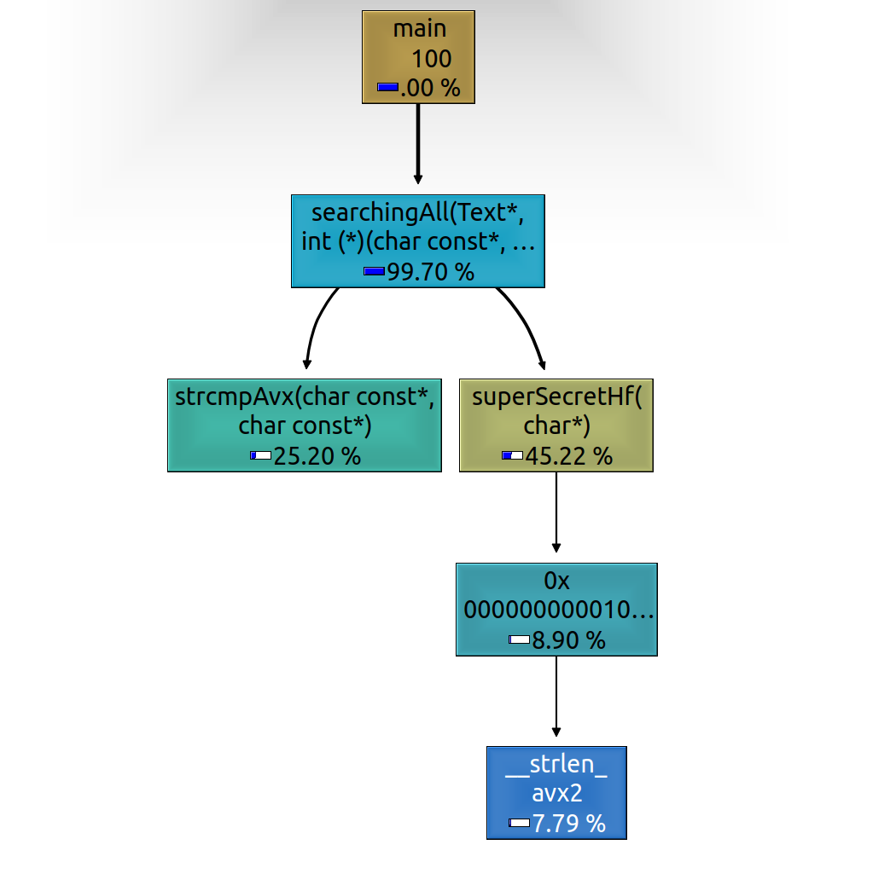

Было решено преписать ёё в ассемблерном виде и вызывать её уже в самой программе. 

```
_trollohash:  
            push rbp								 	
            mov rbp, rsp
            push rbx                            ; rdi - ptr to curr str 
            xor r11, r11
            mov rbx, 1001
            mov rcx, 1

.next:      xor rax, rax
            mov al, byte [rdi]
            cmp al, 0
            je .end
            mul rcx
            add r11, rax
            mov rax, rcx
            mul rbx
            mov rcx, rax
            inc rdi
            jmp .next

.end:
            mov rax, r11
            mov rbx, qword [rbp - 8]
            mov rsp, rbp                        ; skip local data
            pop rbp

            ret
```

Казалось, что компилятор не очень умный, и я смогу сделать функцию ещё быстрее. Но в итоге скорость работы программы уменьшилась:

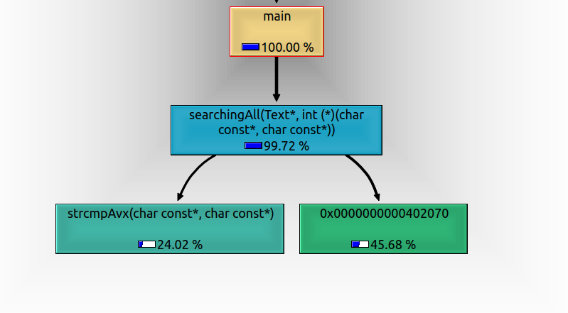

| режимы        | число м. команд    | ускорение          |
| ------------- | ------------------ | ------------------ |
| NO ASM        | 4215002668         | 1.0                |
| ASM           | 4452129302         | 0.94               |

Не всегда попытки оптимизаций оканчиваются успехом, особенно если мы пытаемся использовать функции, написанные на ассемблере.

---

#### Использование интрисиков <a name="crc32"></a>
Чтобы попытаться максимально ускорить работу хэш функций, было принято решение использовать интринсики. В частности, попробуем использовать CRC32:

```c++
unsigned int Crc32hf (char *line)
{
    __m256i *line_vector = (__m256i*) line;

    int hash_sum = 0;

    hash_sum = _mm_crc32_u64 (hash_sum, _mm256_extract_epi64 (*line_vector, 3));
    hash_sum = _mm_crc32_u64 (hash_sum, _mm256_extract_epi64 (*line_vector, 2));
    hash_sum = _mm_crc32_u64 (hash_sum, _mm256_extract_epi64 (*line_vector, 1));
    hash_sum = _mm_crc32_u64 (hash_sum, _mm256_extract_epi64 (*line_vector, 0));
    
    return hash_sum;
}
```


Использование такой хэш функции на преобразованных в 256-битный формат похволило ускорить работу функции почти в два раза.

| режимы        | число м. команд    | ускорение          |
| ------------- | ------------------ | ------------------ |
| NO CRC32      | 4215002668         | 1.0                |
| CRC32         | 2729766089         | 1.54               |


---

### Вывод <a name="conc2"></a>

В данной работе были исследованы устройство хэш-таблиц, работы хэш-функций, было проведено их сравнение. Также активно проводился анализ работы программы через профайлер, изучено влияние отдельных компонентов программы. Главным выводом из проделанной работы является тот факт, что выгодно преобразовать данные так, чтобы их можно было удобнее обрабатывать. На текущей задаче были использованы SIMD-инструкции, которые позволили ускорить программу в 2.1 раз. 

---

## Заключение <a name="conc"></a>
Бла бла бла бла...


 
